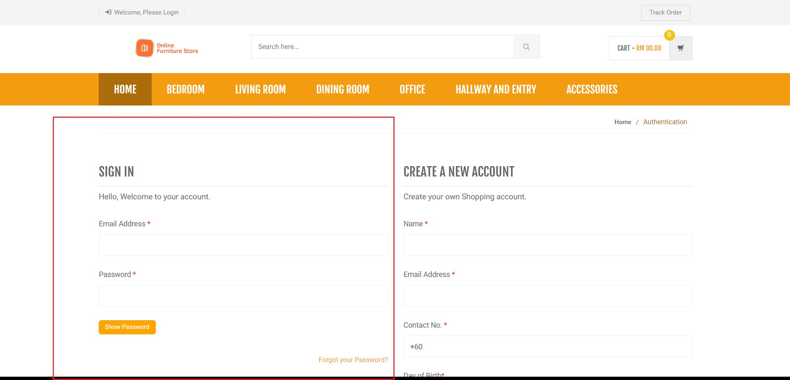
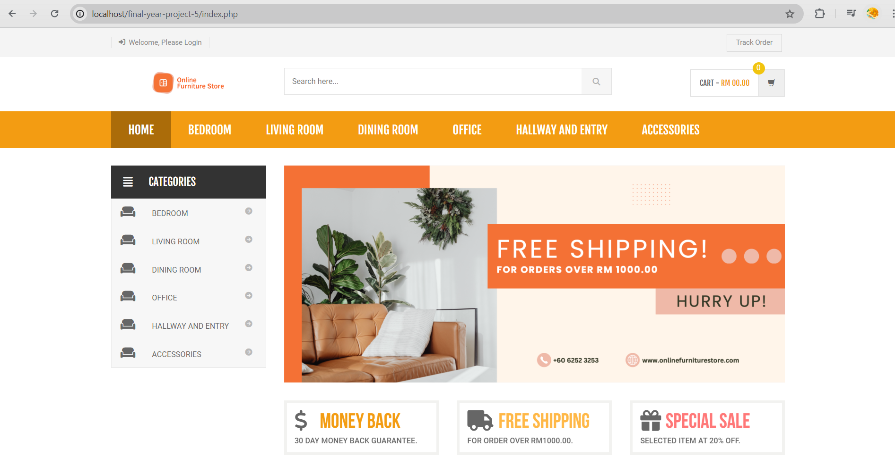
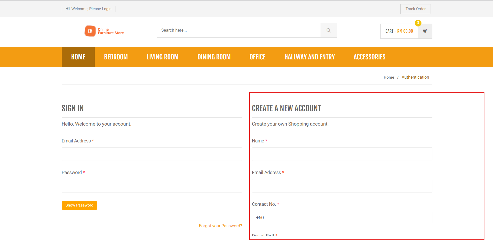

# Furniture-store-website🛒🛒🛏️🛏️
A simple furniture store website developed using PHP, HTML, CSS, and JavaScript
## Introduction 👋👋
This project aims to design and develop a fully functional  furniture store using PHP, HTML, CSS, and JavaScript. The store will offer customers a simple interface for browsing and purchasing furniture products from the comfort of their own homes. Features including product categorization, search functionality, shopping cart, payment functionality, built-in website wallet, and user authentication will all be included in the system. JavaScript will be used for dynamic interactions, HTML and CSS for front-end design, and PHP for server-side scripting. The objective is to build an e-commerce platform that is safe, effective, and scalable, and offers users a flawless online purchasing experience. This report will assess the functionality and performance of the furniture store in addition to detailing the development process, problems encountered, and remedies put in place.
## Main Applications
- Storefront: `index.php`
- Admin panel: `admin/index.php`
- Customer order tracking page: `track-order.php`

## Tech Stack
- Backend: PHP
- Database: MySQL
- Frontend: HTML, CSS, JavaScript, jQuery, Bootstrap

## Setup
1. Place the project inside your local web root, for example XAMPP `htdocs/`.
2. Create a MySQL database named `shopping`.
3. Import `shopping.sql`.
4. Update database credentials if needed:
   - storefront/shared config: `includes/config.php`
   - admin config: `admin/include/config.php`
5. Install PHP dependencies if needed:

```bash
composer install
```

6. Add mail credentials to `.env` if you use the email features.
## 🛠️ Installation Guide  
### To run Customer Portal
1️⃣ **Clone the repository**

2️⃣ **Create a database called shopping inside phpMyAdmin MySQL**

3️⃣ **Import 'shopping.sql' file into the database**

4️⃣ **Move this file to htdocs inside XAMPP file**

5️⃣ **Access the system via LOCALHOST** 🌍

### To run Admin Portal
Go to http://localhost/final-year-project/admin/index.php 
* Superadmin username: admin
* Superadmin password: Test@123
## 📸 **Screenshots of User Interface**







